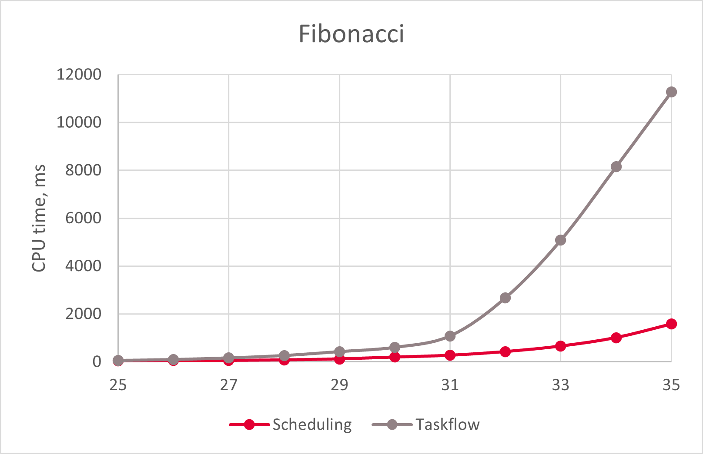
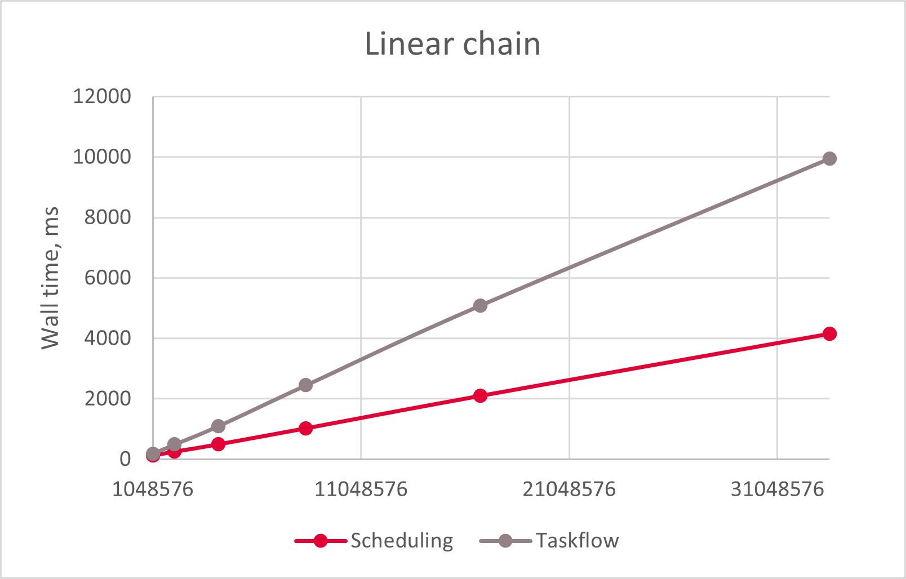

# Scheduling


[](https://github.com/dpuyda/scheduling/actions/workflows/build.yml)

Scheduling is a simple, minimalistic and fast header-only library allowing you
to run async tasks and execute task graphs.

Scheduling is developed with simplicity and performance in mind. The source code
of Scheduling is less than 500 lines.

* [Examples](#examples)
    * [Add Scheduling to your project](#add-scheduling-to-your-project)
    * [Run async tasks](#run-async-tasks)
    * [Build task graphs](#build-task-graphs)
    * [Wait until a specific task is completed](#wait-until-a-specific-task-is-completed)
    * [Wait until a predicate is satisfied](#wait-until-a-predicate-is-satisfied)
    * [Define dependencies between task groups](#define-dependencies-between-task-groups)
    * [Cancel a task](#cancel-a-task)
* [Benchmarks](#benchmarks)
    * [Fibonacci numbers](#fibonacci-numbers)
    * [Linear chain](#linear-chain)
    * [Matrix multiplication](#matrix-multiplication)
* [Implementation details](#implementation-details)
    * [Thread pool](#thread-pool)
    * [Tasks](#tasks)
* [References](#references)

Below are some GitHub projects related to task graphs in which you may also be
interested:

* [Taskflow](https://github.com/taskflow/taskflow)
* [CGraph](https://github.com/ChunelFeng/CGraph)

# Examples

We start with examples demonstrating how to run async tasks and build task
graphs.

## Add Scheduling to your project

To add Scheduling to your project, you can use CMake. For example:
```cmake
target_link_libraries(${PROJECT_NAME} PRIVATE scheduling)
```

Alternatively, you can simply add the content of the `include` folder to your
source code.

## Run async tasks

To run async tasks, create a `ThreadPool` instance. For example:
```cpp
#include "scheduling/scheduling.h"
...
scheduling::ThreadPool thread_pool;
```
In the constructor, the `ThreadPool` instance creates several worker threads
that will be running in the background until the `ThreadPool` instance is
destroyed. As an optional argument, the constructor of the `ThreadPool` class
accepts the number of threads to create. By default, the number of threads is
equal to `std::thread::hardware_concurrency()`.

When the `ThreadPool` instance is created, submit a task. For example:
```cpp
thread_pool.Submit([] {
  std::this_thread::sleep_for(std::chrono::seconds(1));
  std::cout << "Completed" << std::endl;
});
```
A task is a function that does not accept arguments and returns `void`. Use
lambda captures to pass input and output arguments to the task. Eventually, the
task will be executed on one of the worker threads owned by the `ThreadPool`
instance.

If needed, call `Wait` to block the current thread until all submitted tasks
are completed. For example:
```cpp
thread_pool.Wait();
```
In the destructor, the `ThreadPool` instance blocks the current thread until all
submitted tasks are completed.

## Build task graphs

A task graph is a collection of tasks and dependencies between them.
Dependencies between tasks define the order in which the tasks should be
executed.

To define a task graph, create an iterable collection of `Task` instances. For
example:
```cpp
#include "scheduling/scheduling.h"
...
std::vector<scheduling::Task> tasks;
```
The `Task` instances should not be destroyed or reallocated until their
execution is completed by `ThreadPool`.

Add elements to `tasks`. For example, add tasks to calculate the value of
`(a + b) * (c + d)` asynchronously. First, add tasks to get the values of `a`,
`b`, `c` and `d`:
```cpp
int a, b, c, d;

auto& get_a = tasks.emplace_back([&] {
  std::this_thread::sleep_for(std::chrono::seconds(1));
  a = 1;
});

auto& get_b = tasks.emplace_back([&] {
  std::this_thread::sleep_for(std::chrono::seconds(1));
  b = 2;
});

auto& get_c = tasks.emplace_back([&] {
  std::this_thread::sleep_for(std::chrono::seconds(1));
  c = 3;
});

auto& get_d = tasks.emplace_back([&] {
  std::this_thread::sleep_for(std::chrono::seconds(1));
  d = 4;
});
```
Next, add tasks to calculate `a + b` and `c + d`:
```cpp
int sum_ab, sum_cd;

auto& get_sum_ab = tasks.emplace_back([&] {
  std::this_thread::sleep_for(std::chrono::seconds(1));
  sum_ab = a + b;
});

auto& get_sum_cd = tasks.emplace_back([&] {
  std::this_thread::sleep_for(std::chrono::seconds(1));
  sum_cd = c + d;
});
```
Finally, add the task to calculate the product `(a + b) * (c + d)`:
```cpp
int product;

auto& get_product = tasks.emplace_back([&] {
  std::this_thread::sleep_for(std::chrono::seconds(1));
  product = sum_ab * sum_cd;
});
```
When all tasks are added, define task dependencies. The task `get_sum_ab` should
be executed after `get_a` and `get_b`:
```cpp
get_sum_ab.Succeed(&get_a, &get_b);
```
Similarly, the task `get_sum_cd` should be executed after `get_c` and `get_d`:
```cpp
get_sum_cd.Succeed(&get_c, &get_d);
```
Finally, the task `get_product` should be executed after `get_sum_ab` and
`get_sum_cd`:
```cpp
get_product.Succeed(&get_sum_ab, &get_sum_cd);
```
When dependencies between tasks are defined, create a `ThreadPool` instance and
submit the task graph for execution:
```cpp
scheduling::ThreadPool thread_pool;
thread_pool.Submit(tasks);
```
If needed, call `Wait` to block the current thread until all submitted tasks are
completed:
```cpp
thread_pool.Wait();
```

## Wait until a specific task is completed

If needed, use synchronization primitives to wait until a specific task is
completed. For example:
```cpp
scheduling::ThreadPool thread_pool;
std::atomic_flag is_completed;
thread_pool.Submit([&] {
  is_completed.test_and_set();
  is_completed.notify_one();
});
is_completed.wait(false);
```

## Wait until a predicate is satisfied

Under certain scenarios, you might need to block the current thread and execute
submitted tasks in a loop until a specified condition is met. For example, this
may happen when you submit tasks recursively and a task cannot complete until
some other tasks are completed. In this case, all worker threads may get blocked
by tasks that are waiting for other tasks to complete. To keep executing tasks
while waiting until a specified condition is met, use the `Wait` overload
accepting a predicate.

For example, below is a recursive function to calculate Fibonacci numbers
without memoization used in benchmarks:

```cpp
int Fibonacci(ThreadPool& thread_pool, const int n) {
  if (n < 2) {
    return 1;
  }
  int a = 0, b = 0;
  thread_pool.Submit([&, n] { a = Fibonacci(thread_pool, n - 1); });
  thread_pool.Submit([&, n] { b = Fibonacci(thread_pool, n - 2); });
  thread_pool.Wait([&] { return a != 0 && b != 0; });
  return a + b;
}
```

## Define dependencies between task groups

To define dependencies between task groups, use empty tasks.

For example, assume that the tasks `a` and `b` should be executed before the
tasks `c` and `d`. To ensure the order, create an empty task `d` which will
follow `a` and `b` and precede `c` and `d`:
```cpp
scheduling::Task d;
d.Succeed(&a, &b);
d.Precede(&c, &d);
```

## Cancel a task

To cancel a task, call `Task::Cancel`.

Cancelling a task never fails. If `Task::Cancel` returns `false`, this means
that the task has been invoked earlier or will be invoked at least once after
the cancellation. When a task is cancelled and will not be invoked anymore, its
successors also will not be invoked.

For example:
```cpp
scheduling::Task task;
thread_pool.Submit(&task);
if (task.Cancel()) {
  std::cout << "The task will not be invoked" << std::endl;
}
```

To undo cancellation, call `Task::Reset`:

```cpp
task.Reset();
```

## Resubmit a task graph

You can submit a task graph multiple times, but you need to make sure that the
graph is completed before resubmitting it. You cannot submit the same graph
simultaneously from different threads.

# Benchmarks

We compare Scheduling to [Taskflow](https://github.com/taskflow/taskflow), which
is a highly optimized library for parallel and heterogeneous programming
[[1]](#1), [[2]](#2). We use [Google Benchmark](https://github.com/google/benchmark)
for benchmarking. Comparison of Taskflow and other popular libraries for async
programming can be found in Taskflow documentation.

We measure the total time needed to create and execute tasks. The benchmarks
were run on 11th Gen Intel(R) Core(TM) i7-1165G7 @ 2.80GHz, 2083 Mhz, 4 Cores,
8 Logical Processors running Windows 10.0.19045:

```
Run on (8 X 2803 MHz CPU s)
CPU Caches:
  L1 Data 48 KiB (x4)
  L1 Instruction 32 KiB (x4)
  L2 Unified 1280 KiB (x4)
  L3 Unified 12288 KiB (x1)
```

## Fibonacci numbers

To benchmark running async tasks using the `ThreadPool` class, we use the
Taskflow [example](https://github.com/taskflow/taskflow/blob/9616467dd6e6f47f38c6aa39508fd51bf487b876/examples/fibonacci.cpp)
to calculate Fibonacci numbers recursively without memoization.

The charts below demonstrate comparison between the two libraries:

| Wall time | CPU time |
| :------------: | :-------------: |
|  |  |

Below is a sample output of Google Benchmark:

```
------------------------------------------------------------------
Benchmark                        Time             CPU   Iterations
------------------------------------------------------------------
scheduling/fibonacci/25       28.0 ms         13.4 ms           50
scheduling/fibonacci/26       31.6 ms         11.8 ms           45
scheduling/fibonacci/27       64.0 ms         43.9 ms           16
scheduling/fibonacci/28       97.4 ms         78.1 ms           11
scheduling/fibonacci/29        134 ms         99.0 ms            6
scheduling/fibonacci/30        228 ms          184 ms            4
scheduling/fibonacci/31        363 ms          349 ms            3
scheduling/fibonacci/32        547 ms          539 ms            2
scheduling/fibonacci/33        854 ms          656 ms            1
scheduling/fibonacci/34       1349 ms         1359 ms            1
scheduling/fibonacci/35       2203 ms         2188 ms            1
taskflow/fibonacci/25         49.0 ms         31.2 ms           22
taskflow/fibonacci/26         80.0 ms         49.7 ms           11
taskflow/fibonacci/27          129 ms         89.3 ms            7
taskflow/fibonacci/28          212 ms          144 ms            5
taskflow/fibonacci/29          343 ms          234 ms            3
taskflow/fibonacci/30          536 ms          383 ms            2
taskflow/fibonacci/31          982 ms          625 ms            1
taskflow/fibonacci/32         1506 ms         1016 ms            1
taskflow/fibonacci/33         2540 ms         1734 ms            1
```

## Linear chain

To benchmark the simplest example of a task graph, we use the Taskflow
[linear chain](https://github.com/taskflow/taskflow/blob/9616467dd6e6f47f38c6aa39508fd51bf487b876/benchmarks/linear_chain/taskflow.cpp)
benchmark. In this benchmark, we create a task graph where all tasks are
executed sequentially, each task incrementing an integer.

The charts below demonstrate comparison between the two libraries:

| Wall time | CPU time |
| :------------: | :-------------: |
|  |  |

Below is a sample output of Google Benchmark:

```
---------------------------------------------------------------------------
Benchmark                                 Time             CPU   Iterations
---------------------------------------------------------------------------
scheduling/linear_chain/1048576         156 ms          116 ms            5
scheduling/linear_chain/2097152         297 ms          229 ms            3
scheduling/linear_chain/4194304         519 ms          391 ms            2
scheduling/linear_chain/8388608        1064 ms          828 ms            1
scheduling/linear_chain/16777216       2173 ms         1688 ms            1
scheduling/linear_chain/33554432       4431 ms         3453 ms            1
taskflow/linear_chain/1048576           158 ms          125 ms            6
taskflow/linear_chain/2097152           314 ms          258 ms            2
taskflow/linear_chain/4194304           875 ms          750 ms            1
taskflow/linear_chain/8388608          1748 ms         1531 ms            1
taskflow/linear_chain/16777216         3714 ms         3219 ms            1
taskflow/linear_chain/33554432         8137 ms         7219 ms            1
```

## Matrix multiplication

To benchmark a more involved example of a task graph, we use the Taskflow
[matrix multiplication](https://github.com/taskflow/taskflow/blob/9616467dd6e6f47f38c6aa39508fd51bf487b876/benchmarks/matrix_multiplication/taskflow.cpp)
benchmark.

The charts below demonstrate comparison between the two libraries:

| Wall time | CPU time |
| :------------: | :-------------: |
|  |  |

Below is a sample output of Google Benchmark:

```
--------------------------------------------------------------------------------
Benchmark                                      Time             CPU   Iterations
--------------------------------------------------------------------------------
scheduling/matrix_multiplication/128        2.22 ms        0.719 ms         1000
scheduling/matrix_multiplication/256        11.1 ms        0.969 ms         1000
scheduling/matrix_multiplication/512         102 ms         1.41 ms          100
scheduling/matrix_multiplication/1024        961 ms         1.56 ms           10
scheduling/matrix_multiplication/2048      10461 ms         15.6 ms            1
taskflow/matrix_multiplication/128          1.88 ms        0.393 ms         1948
taskflow/matrix_multiplication/256          11.6 ms        0.732 ms          640
taskflow/matrix_multiplication/512           100 ms        0.938 ms          100
taskflow/matrix_multiplication/1024          960 ms         9.38 ms           10
taskflow/matrix_multiplication/2048        10443 ms         31.2 ms            1
```

# Implementation details

In this section, we describe some implementation details of the Scheduling
library.

## Thread pool

Here, we introduce a simple static thread pool to execute task graphs. We
utilize the work-stealing approach [[3]](#3) based on the Chase-Lev deque
[[4]](#4), [[5]](#5).

In the constructor of our `ThreadPool` class, we create a specified number of
worker threads. Each worker thread has a task queue implemented as a Chase-Lev
deque. There is also the main task queue for tasks created on the main thread.

A special property of the Chase-Lev deque consists in the fact that only one
thread can push and pop items at one end of the deque, while other threads can
steal items at the other end. The classical implementation of Chase-Lev deque
can only store pointers, and a pop or steal operation can fail (i.e. return a
`nullptr`) if the deque is empty or if multiple threads are trying to access the
same element at the same time.

When getting a task, a worker thread tries to pop a task from its own task queue
first. In case it fails, it then tries to steal a task from other task queues.
To ensure that only one thread pushes and pops tasks at one end of the queue,
when pushing a task, we need to select the queue very carefully. When a task is
pushed on the main thread, we should always use the main queue. When a task is
pushed on a worker thread, we should use the queue belonging to the same thread.
A typical way to do this is creating a map between thread ID and indices of task
queues (e.g., [[1]](#1)). Then, we can use `std::this_thread::get_id` to get
the ID of the pushing thread and get the index of the correct queue from the
map. A more efficient approach consists in storing indices of task queues in a
thread-local variable. When a worker thread is created, we initialize a
thread-local variable with the corresponding queue index. Then, when pushing a
task, we select the queue based on the index stored in this variable.
Thread-locality ensures that the correct queue is selected.

To track the total number of tasks in the queues, we use an atomic counter.
`std::atomic<T>::wait`, which is added in C++20, allows us to put a worker
thread to sleep when there are no tasks in the queues.

## Tasks

A task is a simple wrapper over an `std::function<void()>` instance. It also
stores the successor tasks and the number of uncompleted predecessor tasks. When
`ThreadPool` executes a task, it executes the wrapped function first. Then, for
each successor task, it decrements the number of uncompleted predecessors. One
of the successors, for which the number of uncompleted predecessors becomes
equal to zero, is then executed on the same worker thread. Other successors, for
which the number of uncompleted predecessors becomes equal to zero, are
submitted to the same `ThreadPool` instance for execution.

# References

<a id="1">[1]</a> Chun-Xun Lin, Tsung-Wei Huang and Martin D. F. Wong, An
Efficient Work-Stealing Scheduler for Task Dependency Graph

<a id="2">[2]</a> Tsung-Wei Huang, Dian-Lun Lin, Chun-Xun Lin, and Yibo Lin,
Taskflow: A Lightweight Parallel and Heterogeneous Task Graph Computing System

<a id="3">[3]</a> Anthony Williams, C++ Concurrency in Action, 2nd Edition,
Manning, 592 pages, 2019.

<a id="4">[4]</a> David Chase and Yossi Lev. Dynamic circular work-stealing
deque. In Proceedings of the seventeenth annual ACM symposium on Parallelism in
algorithms and architectures, SPAA '05, pages 21-28, New York, NY, USA, 2005.
ACM.

<a id="5">[5]</a> N.M. Le, A. Pop, A. Cohen, and F. Zappa Nardelli. Correct and
efficient work-stealing for weak memory models. In Proceedings of the 18th ACM
SIGPLAN Symposium on Principles and Practice of Parallel Programming, PPoPP '13,
pages 69-80, New York, NY, USA, 2013. ACM.
