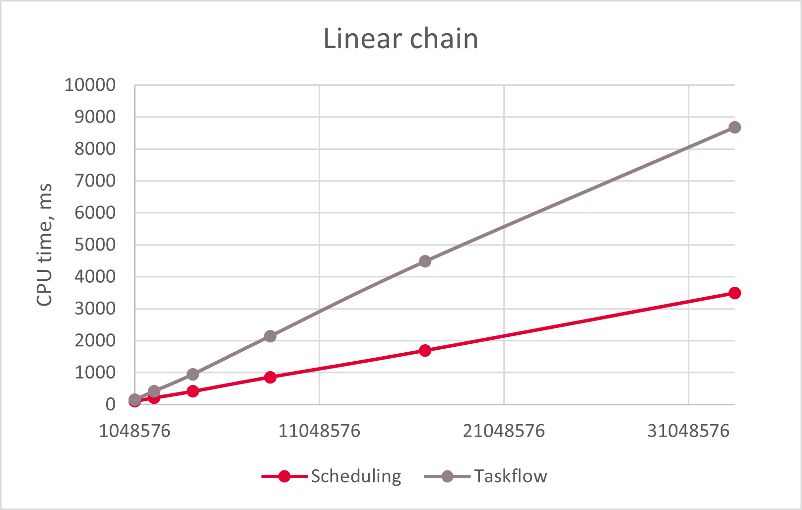
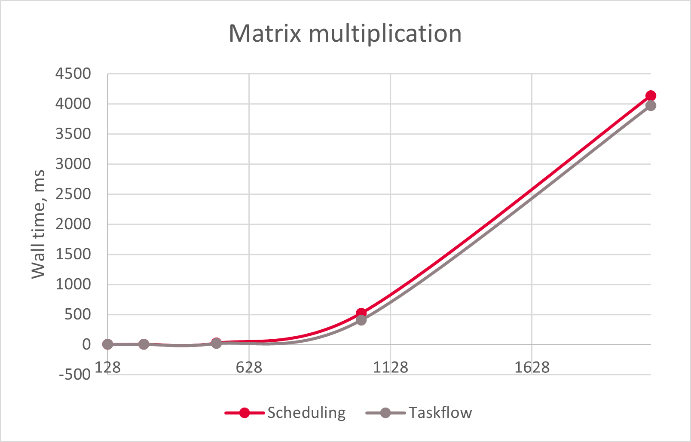

# Scheduling


[](https://github.com/dpuyda/scheduling/actions/workflows/build.yml)
[](https://arxiv.org/abs/2407.15805)

Scheduling is a simple, minimalistic and fast library allowing you to run async
tasks and task graphs.

Scheduling is developed with simplicity and performance in mind.

* [Examples](#examples)
    * [Add Scheduling to your project](#add-scheduling-to-your-project)
    * [Run async tasks](#run-async-tasks)
    * [Build task graphs](#build-task-graphs)
    * [Wait until a specific task is completed](#wait-until-a-specific-task-is-completed)
    * [Wait until a condition is satisfied](#wait-until-a-condition-is-satisfied)
    * [Define dependencies between task groups](#define-dependencies-between-task-groups)
    * [Cancel a task](#cancel-a-task)
    * [Resubmit a task graph](#resubmit-a-task-graph)
* [Benchmarks](#benchmarks)
    * [Fibonacci numbers](#fibonacci-numbers)
    * [Linear chain](#linear-chain)
    * [Matrix multiplication](#matrix-multiplication)
* [Implementation details](#implementation-details)
    * [Thread pool](#thread-pool)
    * [Tasks](#tasks)
* [License](#license)
    * [Third-party licenses](#third-party-licenses)
* [References](#references)

Below are some GitHub projects related to thread pools and task graphs in which
you may be interested:

* [Taskflow](https://github.com/taskflow/taskflow)
* [enkiTS](https://github.com/dougbinks/enkiTS)
* [CGraph](https://github.com/ChunelFeng/CGraph)
* https://github.com/bshoshany/thread-pool
* https://github.com/DeveloperPaul123/thread-pool

# Examples

We start with examples demonstrating how to run async tasks and task graphs.

## Add Scheduling to your project

When using CMake 3.11 or newer, you can add Scheduling to your project using
`FetchContent`. For example:
```cmake
include(FetchContent)

FetchContent_Declare(
  scheduling
  GIT_REPOSITORY https://github.com/dpuyda/scheduling
  GIT_TAG main
  GIT_SHALLOW TRUE
)

FetchContent_MakeAvailable(scheduling)
```

Alternatively, you can add Scheduling as a subdirectory. For example:
```cmake
add_subdirectory(scheduling)
```

Then, link Scheduling to your target. For example:
```cmake
target_link_libraries(${PROJECT_NAME} PRIVATE scheduling)
```

> [!NOTE]  
To build Scheduling, you need C++20 or newer. For example:
>```cmake
>set(CMAKE_CXX_STANDARD 20)
>```

## Run async tasks

To run async tasks, create a `ThreadPool` instance. For example:
```cpp
#include "scheduling/scheduling.hpp"
...
scheduling::ThreadPool thread_pool;
```
In the constructor, the `ThreadPool` class creates several worker threads
that will be running in the background until the instance is
destroyed. As an optional argument, the constructor of the `ThreadPool` class
accepts the number of threads to create. By default, the number of threads is
equal to `std::thread::hardware_concurrency()`.

When the `ThreadPool` instance is created, submit a task. For example:
```cpp
thread_pool.Submit([] {
  std::this_thread::sleep_for(std::chrono::seconds(1));
  std::cout << "Completed.\n";
});
```
A task is a function that does not accept arguments and returns `void`. Use
lambda captures to pass input and output arguments to the task. Eventually, the
task will be executed on one of the worker threads owned by the `ThreadPool`
instance.

If needed, call `Wait()` to block the current thread until all submitted tasks
are completed. For example:
```cpp
thread_pool.Wait();
```
In the destructor, the `ThreadPool` class blocks the current thread until all
submitted tasks are completed.

## Build task graphs

A task graph is a collection of tasks and dependencies between them.
Dependencies between tasks define the order in which the tasks should be
executed.

To define a task graph, create an iterable collection of `Task` instances. For
example:
```cpp
#include "scheduling/scheduling.hpp"
...
std::vector<scheduling::Task> tasks;
```
The `Task` instances should not be destroyed or reallocated until their
execution is completed by `ThreadPool`.

Add elements to `tasks`. For example, add tasks to calculate the value of
`(a + b) * (c + d)` asynchronously. First, add tasks to get the values of `a`,
`b`, `c` and `d`:
```cpp
int a, b, c, d;

auto& get_a = tasks.emplace_back([&] {
  std::this_thread::sleep_for(std::chrono::seconds(1));
  a = 1;
});

auto& get_b = tasks.emplace_back([&] {
  std::this_thread::sleep_for(std::chrono::seconds(1));
  b = 2;
});

auto& get_c = tasks.emplace_back([&] {
  std::this_thread::sleep_for(std::chrono::seconds(1));
  c = 3;
});

auto& get_d = tasks.emplace_back([&] {
  std::this_thread::sleep_for(std::chrono::seconds(1));
  d = 4;
});
```
Next, add tasks to calculate `a + b` and `c + d`:
```cpp
int sum_ab, sum_cd;

auto& get_sum_ab = tasks.emplace_back([&] {
  std::this_thread::sleep_for(std::chrono::seconds(1));
  sum_ab = a + b;
});

auto& get_sum_cd = tasks.emplace_back([&] {
  std::this_thread::sleep_for(std::chrono::seconds(1));
  sum_cd = c + d;
});
```
Finally, add the task to calculate the product `(a + b) * (c + d)`:
```cpp
int product;

auto& get_product = tasks.emplace_back([&] {
  std::this_thread::sleep_for(std::chrono::seconds(1));
  product = sum_ab * sum_cd;
});
```
When all tasks are added, define task dependencies. The task `get_sum_ab` should
be executed after `get_a` and `get_b`:
```cpp
get_sum_ab.Succeed(&get_a, &get_b);
```
Similarly, the task `get_sum_cd` should be executed after `get_c` and `get_d`:
```cpp
get_sum_cd.Succeed(&get_c, &get_d);
```
Finally, the task `get_product` should be executed after `get_sum_ab` and
`get_sum_cd`:
```cpp
get_product.Succeed(&get_sum_ab, &get_sum_cd);
```
When dependencies between tasks are defined, create a `ThreadPool` instance and
submit the task graph for execution:
```cpp
scheduling::ThreadPool thread_pool;
thread_pool.Submit(tasks);
```
If needed, call `Wait()` to block the current thread until all submitted tasks
are completed:
```cpp
thread_pool.Wait();
```

## Wait until a specific task is completed

If needed, use synchronization primitives to wait until a specific task is
completed. For example:
```cpp
scheduling::ThreadPool thread_pool;
std::atomic_flag is_completed;
thread_pool.Submit([&] {
  is_completed.test_and_set();
  is_completed.notify_one();
});
is_completed.wait(false);
```

## Wait until a condition is satisfied

Under certain scenarios, you might need to block the current thread and execute
submitted tasks in a loop until a specific condition is met. For example, this
can happen when tasks are submitted recursively, and a task cannot complete
until other tasks have finished. In such cases, all worker threads may become
blocked by tasks waiting for other tasks to complete. To continue executing
tasks while waiting for a condition to be satisfied, use the Wait overload that
accepts a predicate.

For example, below is a recursive function to calculate Fibonacci numbers
without memoization used in the benchmarks:

```cpp
int Fibonacci(ThreadPool& thread_pool, const int n) {
  if (n < 2) {
    return 1;
  }
  int a, b;
  std::atomic counter{0};
  thread_pool.Submit([&, n] {
    a = Fibonacci(thread_pool, n - 1);
    counter.fetch_add(1);
  });
  thread_pool.Submit([&, n] {
    b = Fibonacci(thread_pool, n - 2);
    counter.fetch_add(1);
  });
  thread_pool.Wait([&] { return counter.load() == 2; });
  return a + b;
}
```

> [!WARNING]  
> Beware of recursion! If `Wait` is called recursively, e.g., as shown in the
> example above, the stack depth can be exceeded.

## Define dependencies between task groups

To define dependencies between task groups, use empty tasks.

For example, assume that the tasks `a` and `b` should be executed before the
tasks `c` and `d`. To ensure the order, create an empty task `d` which will
follow `a` and `b` and precede `c` and `d`:
```cpp
scheduling::Task d;
d.Succeed(&a, &b);
d.Precede(&c, &d);
```

## Cancel a task

To cancel a task, call `Task::Cancel()`.

Cancelling a task never fails. If `Task::Cancel()` returns `false`, this means
that the task has been invoked earlier or will be invoked at least once after
the cancellation. When a task is cancelled and will not be invoked anymore, its
successors also will not be invoked.

For example:
```cpp
scheduling::Task task;
thread_pool.Submit(&task);
if (task.Cancel()) {
  std::cout << "The task will not be invoked.\n";
}
```

To undo cancellation, call `Task::Reset()`:

```cpp
task.Reset();
```

## Resubmit a task graph

You can submit a task graph multiple times, but you need to make sure that the
graph is completed before resubmitting it. You cannot submit the same graph
simultaneously from different threads.

# Benchmarks

We compare Scheduling with [Taskflow](https://github.com/taskflow/taskflow),
a highly optimized library for parallel and heterogeneous programming
[[1]](#1), [[2]](#2). We use [Google Benchmark](https://github.com/google/benchmark)
for benchmarking. Comparison of Taskflow and popular libraries for async
programming can be found in Taskflow documentation.

We measure the total time needed to create and execute tasks. The benchmarks
were run on Intel(R) Xeon(R) CPU i7-1165G7 @ 2.80GHz with 32 CPUs,
running Debian GNU/Linux 12 (bookworm):

```
Run on (32 X 2800.27 MHz CPU s)
CPU Caches:
  L1 Data 32 KiB (x16)
  L1 Instruction 32 KiB (x16)
  L2 Unified 1024 KiB (x16)
  L3 Unified 33792 KiB (x2)
Load Average: 3.83, 2.00, 0.78
```

The comparison was made between commit [ae8a367](https://github.com/dpuyda/scheduling/commit/ae8a36702193f6eeb4d3e36090e70c57d67ce413)
of Scheduling and commit [9823d00](https://github.com/taskflow/taskflow/commit/9823d00e119b2205943de737b9ca5f93c5cc26bd)
of Taskflow.

## Fibonacci numbers

To benchmark running a large number of async tasks using the `ThreadPool` class,
we use the Taskflow [example](https://github.com/taskflow/taskflow/blob/9616467dd6e6f47f38c6aa39508fd51bf487b876/examples/fibonacci.cpp)
to calculate Fibonacci numbers recursively without memoization.

The charts below demonstrate comparison between the two libraries:

| Wall time | CPU time |
| :------------: | :-------------: |
|  |  |

Below is a sample output of Google Benchmark:

```
------------------------------------------------------------------
Benchmark                        Time             CPU   Iterations
------------------------------------------------------------------
scheduling/fibonacci/25       42.4 ms         36.8 ms           20
scheduling/fibonacci/26       59.1 ms         55.6 ms           10
scheduling/fibonacci/27       60.4 ms         57.0 ms            9
scheduling/fibonacci/28       89.5 ms         78.7 ms            8
scheduling/fibonacci/29        132 ms          121 ms            5
scheduling/fibonacci/30        200 ms          197 ms            3
scheduling/fibonacci/31        279 ms          273 ms            4
scheduling/fibonacci/32        427 ms          426 ms            2
scheduling/fibonacci/33        658 ms          658 ms            1
scheduling/fibonacci/34       1079 ms         1011 ms            1
scheduling/fibonacci/35       1661 ms         1578 ms            1
taskflow/fibonacci/25         65.3 ms         56.4 ms           10
taskflow/fibonacci/26          106 ms         94.1 ms            8
taskflow/fibonacci/27          180 ms          163 ms            5
taskflow/fibonacci/28          291 ms          263 ms            3
taskflow/fibonacci/29          468 ms          427 ms            2
taskflow/fibonacci/30          998 ms          605 ms            1
taskflow/fibonacci/31         1765 ms         1083 ms            1
taskflow/fibonacci/32         3755 ms         2678 ms            1
taskflow/fibonacci/33         6827 ms         5083 ms            1
taskflow/fibonacci/34        11034 ms         8153 ms            1
taskflow/fibonacci/35        15058 ms        10284 ms            1
```

## Linear chain

To benchmark the simplest example of a task graph, we use the Taskflow
[linear chain](https://github.com/taskflow/taskflow/blob/9616467dd6e6f47f38c6aa39508fd51bf487b876/benchmarks/linear_chain/taskflow.cpp)
benchmark. In this benchmark, we create a task graph where all tasks are
executed sequentially, each task incrementing an integer.

The charts below demonstrate comparison between the two libraries:

| Wall time | CPU time |
| :------------: | :-------------: |
|  |  |

Below is a sample output of Google Benchmark:

```
---------------------------------------------------------------------------
Benchmark                                 Time             CPU   Iterations
---------------------------------------------------------------------------
scheduling/linear_chain/1048576         125 ms          104 ms            7
scheduling/linear_chain/2097152         250 ms          208 ms            3
scheduling/linear_chain/4194304         495 ms          411 ms            2
scheduling/linear_chain/8388608        1024 ms          856 ms            1
scheduling/linear_chain/16777216       2100 ms         1689 ms            1
scheduling/linear_chain/33554432       4158 ms         3486 ms            1
taskflow/linear_chain/1048576           190 ms          152 ms            5
taskflow/linear_chain/2097152           496 ms          420 ms            2
taskflow/linear_chain/4194304          1101 ms          950 ms            1
taskflow/linear_chain/8388608          2449 ms         2145 ms            1
taskflow/linear_chain/16777216         5090 ms         4484 ms            1
taskflow/linear_chain/33554432         9951 ms         8685 ms            1
```

## Matrix multiplication

To benchmark a more involved example of a task graph, we use the Taskflow
[matrix multiplication](https://github.com/taskflow/taskflow/blob/9616467dd6e6f47f38c6aa39508fd51bf487b876/benchmarks/matrix_multiplication/taskflow.cpp)
benchmark.

The charts below demonstrate comparison between the two libraries:

| Wall time | CPU time |
| :------------: | :-------------: |
|  |  |

Below is a sample output of Google Benchmark:

```
--------------------------------------------------------------------------------
Benchmark                                      Time             CPU   Iterations
--------------------------------------------------------------------------------
scheduling/matrix_multiplication/128        2.78 ms         1.55 ms          444
scheduling/matrix_multiplication/256        8.20 ms         2.12 ms          333
scheduling/matrix_multiplication/512        25.8 ms         3.36 ms          100
scheduling/matrix_multiplication/1024        522 ms         4.22 ms           10
scheduling/matrix_multiplication/2048       4134 ms         11.9 ms            1
taskflow/matrix_multiplication/128          2.34 ms         1.49 ms          472
taskflow/matrix_multiplication/256          4.13 ms         1.62 ms          433
taskflow/matrix_multiplication/512          19.0 ms         2.71 ms          270
taskflow/matrix_multiplication/1024          408 ms         7.88 ms           10
taskflow/matrix_multiplication/2048         3970 ms         29.5 ms            1
```

# Implementation details

In this section, we briefly describe some implementation details of the
Scheduling library.

## Chase-Lev deque

The idea of work-stealing queues is to provide each worker thread with its own task queue to reduce
thread contention [[3]](#3). When a task is submitted, it is pushed to one of the queues. The thread
owning the queue can eventually pick up the task and execute it. If there are no tasks in the queue
owned by a worker thread, the thread attempts to steal a task from another queue.

Work-stealing queues are typically implemented as lock-free deques. The owning thread pops elements
at one end of the deque, while other threads steal elements at the other end.

Implementing a work-stealing deque is not an easy task. The Chase-Lev deque [[4]](#4), [[5]](#5) is
one of the most commonly used implementations of such a deque. The original C11 implementation of
the Chase-Lev deque [[5]](#5) uses atomic thread fences without associated atomic operations. When
compiling with a thread sanitizer, GCC 13 issues a warning saying that `atomic_thread_fence` is
not supported with `-fsanitize=thread`. Thread sanitizers may produce false positives when atomic
thread fences are used. For example, when using the Taskflow implementation of the work-stealing
deque, the thread sanitizer detects data races in the solution suggested in this paper. The Taskflow
implementation of the deque contains the following lines of code:
```cpp
std::atomic_thread_fence(std::memory_order_release);
_bottom[p].data.store(b + 1, std::memory_order_relaxed);
```
If `memory_order_relaxed` is replaced here by `memory_order_release`, the sanitizer stops detecting
the data races. This might indicate a false positive related to the usage of
`std::atomic_thread_fence`. It is worth noting that Taskflow unit tests and examples pass with the
thread sanitizer even though `std::atomic_thread_fence` is used.

An example of a work-stealing deque implementation that does not use `std::atomic_thread_fence` can
be found in [Google Filament](https://github.com/google/filament). When using the implementation
from Google Filament, the thread sanitizer does not detect data races in the suggested solution.

Concurrent push and pop operations are not allowed in most implementations of the work-stealing
deque. To ensure that there are no concurrent push and pop operations, mappings from thread ID to
queue indices are typically used. When a task is pushed to or popped from a queue, the correct queue
is usually found using the current thread ID. Unlike this typical approach, the solution suggested
in this paper uses a thread-local variable to find the correct task queue. It makes the solution not
header-only, but this will not matter once modules from the C++20 standard are used. Unfortunately,
at the time of writing this paper, there seems to be not enough compiler support to present the
suggested solution in the form of a cross-platform module.

## Task graphs

To run task graphs, simple wrappers over an `std::function<void()>` are used. Each wrapper stores
references to successor tasks and the number of uncompleted predecessor tasks. When the thread pool
executes a task, it first executes the wrapped function. Then, for each successor task, it
decrements the number of uncompleted predecessor tasks. One of the successor tasks, for which the
number of uncompleted predecessor tasks becomes equal to zero, is then executed on the same worker
thread. Other successor tasks, for which the number of uncompleted predecessor tasks becomes equal
to zero, are submitted to the same thread pool instance for execution.

# License

This project is licensed under the [MIT License](LICENSE).

## Third-party licenses

* This project includes code from
  [Google Filament](https://github.com/google/filament), which is licensed under
  the Apache License 2.0. You can find the text of the Apache License 2.0 in the
  [LICENSE-APACHE](LICENSE-APACHE) file.

* This project includes code from [Taskflow](https://github.com/taskflow/taskflow),
  which is licensed under the MIT license.

# References

<a id="1">[1]</a> Chun-Xun Lin, Tsung-Wei Huang and Martin D. F. Wong, *An
Efficient Work-Stealing Scheduler for Task Dependency Graph*, IEEE 26th
International Conference on Parallel and Distributed Systems (ICPADS),
pages 64-71, 2020.

<a id="2">[2]</a> Tsung-Wei Huang, Dian-Lun Lin, Chun-Xun Lin, and Yibo Lin,
*Taskflow: A Lightweight Parallel and Heterogeneous Task Graph Computing System*,
IEEE Transactions on Parallel and Distributed Systems, Volume 33, Issue 6, pages
1303-1320, 2022.

<a id="3">[3]</a> Anthony Williams, *C++ Concurrency in Action*, 2nd Edition,
Manning, 592 pages, 2019.

<a id="4">[4]</a> David Chase and Yossi Lev, *Dynamic circular work-stealing
deque*, SPAA '05: Proceedings of the seventeenth annual ACM symposium on
Parallelism in algorithms and architectures, pages 21-28, 2005.

<a id="5">[5]</a> N.M. Le, A. Pop, A. Cohen, and F. Zappa Nardelli. *Correct and
efficient work-stealing for weak memory models*, Proceedings of the 18th ACM
SIGPLAN Symposium on Principles and Practice of Parallel Programming,
pages 69-80, 2013.
